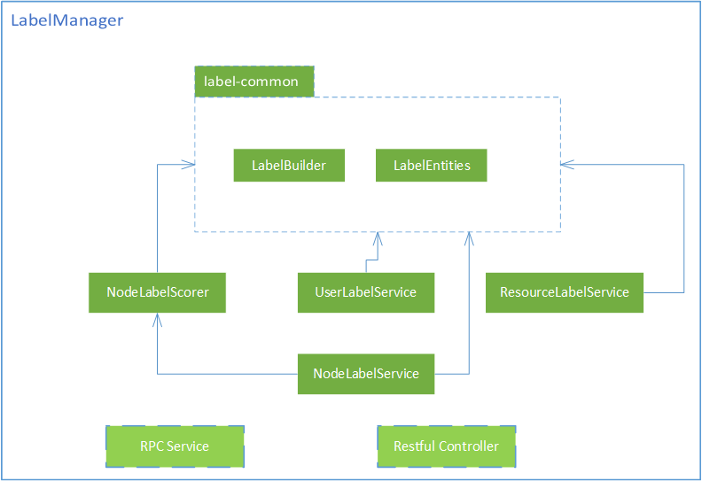
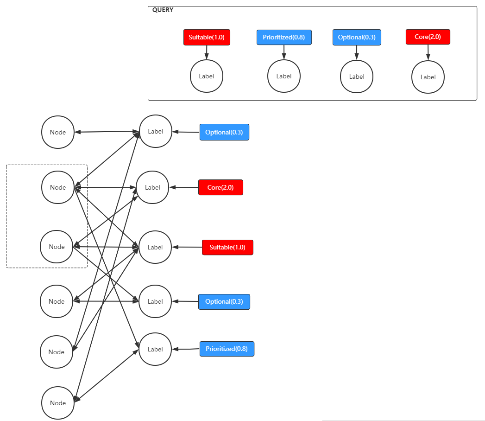

## LabelManager architecture design

#### Brief description
LabelManager is a functional module in Linkis that provides label services to upper-level applications. It uses label technology to manage cluster resource allocation, service node election, user permission matching, and gateway routing and forwarding; it includes generalized analysis and processing tools that support various custom Label labels, And a universal tag matching scorer.
### Overall architecture schematic

  

#### Architecture description
- LabelBuilder: Responsible for the work of label analysis. It can parse the input label type, keyword or character value to obtain a specific label entity. There is a default generalization implementation class or custom extensions.
- LabelEntities: Refers to a collection of label entities, including cluster labels, configuration labels, engine labels, node labels, routing labels, search labels, etc.
- NodeLabelService: The associated service interface class of instance/node and label, which defines the interface method of adding, deleting, modifying and checking the relationship between the two and matching the instance/node according to the label.
- UserLabelService: Declare the associated operation between the user and the label.
- ResourceLabelService: Declare the associated operations of cluster resources and labels, involving resource management of combined labels, cleaning or setting the resource value associated with the label.
- NodeLabelScorer: Node label scorer, corresponding to the implementation of different label matching algorithms, using scores to indicate node label matching.

### 1. LabelBuilder parsing process
Take the generic label analysis class GenericLabelBuilder as an example to clarify the overall process:
The process of label parsing/construction includes several steps:
1. According to the input, select the appropriate label class to be parsed.
2. According to the definition information of the tag class, recursively analyze the generic structure to obtain the specific tag value type.
3. Convert the input value object to the tag value type, using implicit conversion or positive and negative analysis framework.
4. According to the return of 1-3, instantiate the label, and perform some post operations according to different label classes.

### 2. NodeLabelScorer scoring process
In order to select a suitable engine node based on the tag list attached to the Linkis user execution request, it is necessary to make a selection of the matching engine list, which is quantified as the tag matching degree of the engine node, that is, the score.
In the label definition, each label has a feature value, namely CORE, SUITABLE, PRIORITIZED, OPTIONAL, and each feature value has a boost value, which is equivalent to a weight and an incentive value.
At the same time, some features such as CORE and SUITABLE must be unique features, that is, strong filtering is required during the matching process, and a node can only be associated with one CORE/SUITABLE label.
According to the relationship between existing tags, nodes, and request attached tags, the following schematic diagram can be drawn:
  

The built-in default scoring logic process should generally include the following steps:
1. The input of the method should be two sets of network relationship lists, namely `Label -> Node` and `Node -> Label`, where the Node node in the `Node -> Label` relationship must have all the CORE and SUITABLE feature labels, these nodes are also called candidate nodes.
2. The first step is to traverse and calculate the relationship list of `Node -> Label`, and traverse the label Label associated with each node. In this step, the label is scored first. If the label is not the label attached to the request, the score is 0.
Otherwise, the score is divided into: (basic score/the number of times the tag corresponds to the feature value in the request) * the incentive value of the corresponding feature value, where the basic score defaults to 1, and the initial score of the node is the sum of the associated tag scores; where because The CORE/SUITABLE type label must be the only label, and the number of occurrences is always 1.
3. After obtaining the initial score of the node, the second step is to traverse the calculation of the `Label -> Node` relationship. Since the first step ignores the effect of unrequested attached labels on the score, the proportion of irrelevant labels will indeed affect the score. This type of label is unified with the UNKNOWN feature, and this feature also has a corresponding incentive value;
We set that the higher the proportion of candidate nodes associated with irrelevant labels in the total associated nodes, the more significant the impact on the score, which can further accumulate the initial score of the node obtained in the first step.
4. Normalize the standard deviation of the scores of the candidate nodes and sort them.
