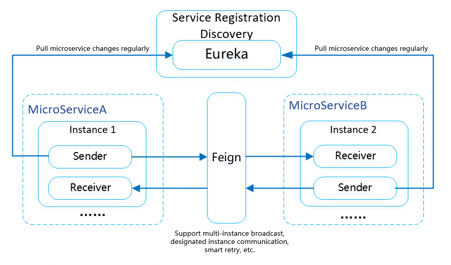

## **Background**

Microservice governance includes three main microservices: Gateway, Eureka and Open Feign.
It is used to solve Linkis's service discovery and registration, unified gateway, request forwarding, inter-service communication, load balancing and other issues. 
At the same time, Linkis 1.0 will also provide the supporting for Nacos; the entire Linkis is a complete microservice architecture and each business progress requires multiple microservices to complete.

## **Architecture diagram**

## **Architecture Introduction**

1. Linkis Gateway  
As the gateway entrance of Linkis, Linkis Gateway is mainly responsible for request forwarding, user access authentication and WebSocket communication. 
The Gateway of Linkis 1.0 also added Label-based routing and forwarding capabilities. 
A WebSocket routing and forwarder is implemented by Spring Cloud Gateway in Linkis, it is used to establish a WebSocket connection with the client.
After the connection is established, it will automatically analyze the client's WebSocket request and determine which backend microservice the request should be forward to through the rules, 
then the request is forwarded to the corresponding backend microservice instance.  
&nbsp;&nbsp;&nbsp;&nbsp;&nbsp;[Linkis Gateway](Gateway.md)

2. Linkis Eureka  
Mainly responsible for service registration and discovery. Eureka consists of multiple instances(service instances). These service instances can be divided into two types: Eureka Server and Eureka Client. 
For ease of understanding, we divide Eureka Client into Service Provider and Service Consumer. Eureka Server provides service registration and discovery. 
The Service Provider registers its own service with Eureka, so that service consumers can find it.
The Service Consumer obtains a listed of registered services from Eureka, so that they can consume services.

3. Linkis has implemented a set of its own underlying RPC communication schema based on Feign. As the underlying communication solution, Linkis RPC integrates the SDK into the microservices in need. 
A microservice can be both the request caller and the request receiver.
As the request caller, the Receiver of the target microservice will be requested through the Sender.
As the request receiver, the Receiver will be provided to process the request sent by the Sender in order to complete the synchronous response or asynchronous response.
   
   