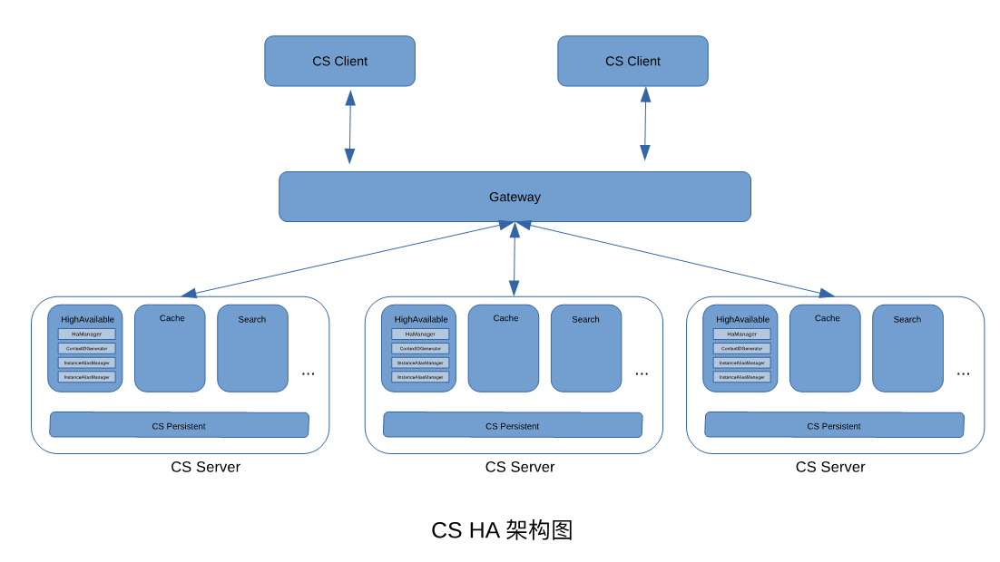
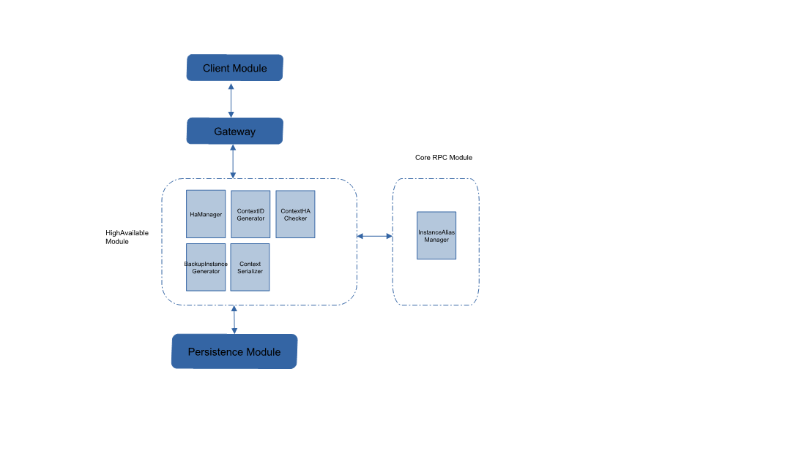
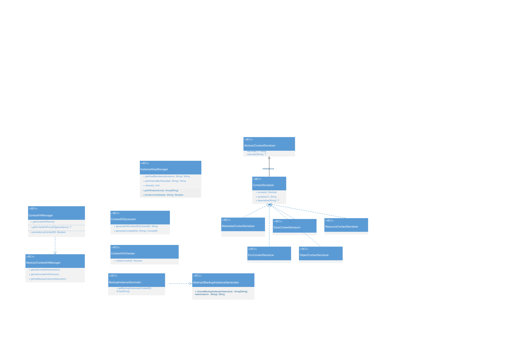
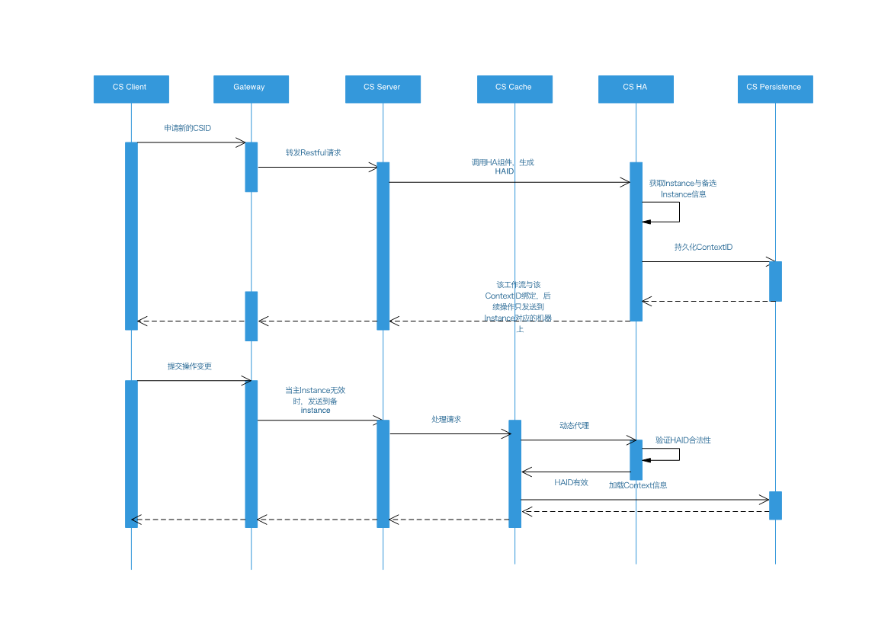

## **CS HA Architecture Design**

### 1, CS HA architecture summary

#### (1) CS HA architecture diagram

#### (2) Problems to be solved

-HA of Context instance object

-Client generates CSID request when creating workflow

-List of aliases of CS Server

-Unified CSID generation and analysis rules

#### (3) Main design ideas

① Load balancing

When the client creates a new workflow, it randomly requests the HA module of a certain server to generate a new HAID with equal probability. The HAID information includes the main server information (hereinafter referred to as the main instance), and the candidate instance, where the candidate instance is The instance with the lowest load among the remaining servers, and a corresponding ContextID. The generated HAID is bound to the workflow and is persisted to the database, and then all change operation requests of the workflow will be sent to the main instance to achieve uniform load distribution.

②High availability

In subsequent operations, when the client or gateway determines that the main instance is unavailable, the operation request is forwarded to the standby instance for processing, thereby achieving high service availability. The HA module of the standby instance will first verify the validity of the request based on the HAID information.

③Alias ​​mechanism

The alias mechanism is adopted for the machine, the Instance information contained in the HAID adopts a custom alias, and the alias mapping queue is maintained in the background. It is that the client uses HAID when interacting with other components in the background, and uses ContextID when interacting with other components in the background. When implementing specific operations, a dynamic proxy mechanism is used to convert HAID to ContextID for processing.

### 2, module design

#### (1) Module diagram

#### (2) Specific modules

①ContextHAManager module

Provide interface for CS Server to call to generate CSID and HAID, and provide alias conversion interface based on dynamic proxy;

Call the persistence module interface to persist CSID information;

②AbstractContextHAManager module

The abstraction of ContextHAManager can support the realization of multiple ContextHAManager;

③InstanceAliasManager module

RPC module provides Instance and alias conversion interface, maintains alias mapping queue, and provides alias and CS
Server instance query; provide an interface to verify whether the host is valid;

④HAContextIDGenerator module

Generate a new HAID and encapsulate it into the client's agreed format and return it to the client. The HAID structure is as follows:

\${length of first instance}\${length of second instance}{instance alias 1} {instance alias 2} {actual ID}, the actual ID is set as ContextID
Key;

⑤ContextHAChecker module

Provide HAID verification interface. Each request received will verify whether the ID format is valid, and whether the current host is the primary instance or the secondary instance: if it is the primary instance, the verification is passed; if it is the secondary instance, verify whether the primary instance is invalid and the primary instance is invalid The verification is passed.

⑥BackupInstanceGenerator module

Generate a backup instance and attach it to the CSID information;

⑦MultiTenantBackupInstanceGenerator interface

(Reserved interface, not implemented yet)

### 3. UML Class Diagram

### 4. HA module operation sequence diagram

CSID generated for the first time:
The client sends a request, and the Gateway forwards it to any server. The HA module generates the HAID, including the main instance, the backup instance and the CSID, and completes the binding of the workflow and the HAID.

When the client sends a change request, Gateway determines that the main Instance is invalid, and then forwards the request to the standby Instance for processing. After the instance on the standby Instance verifies that the HAID is valid, it loads the instance and processes the request.