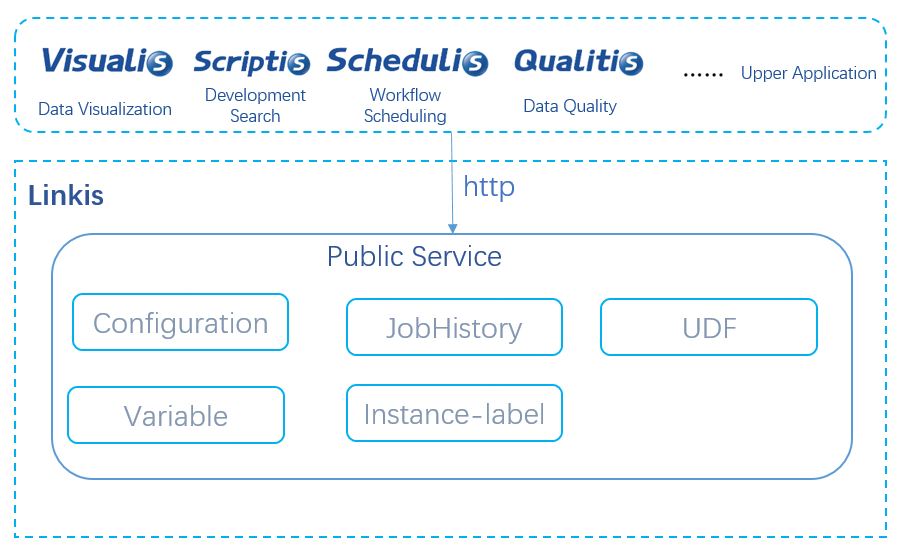

## **Background**

PublicService is a comprehensive service composed of multiple sub-modules such as "configuration", "jobhistory", "udf", "variable", etc. Linkis 
1.0 added label management based on version 0.9. Linkis doesn't need to set the parameters every time during the execution of different jobs.
Many variables, functions and configurations can be reused after the user completes the settings once, and of course that they can also be shared with other users.

## **Architecture diagram**

## **Architecture Introduction**

1. linkis-configuration：Provides query and save operations for global settings and general settings, especially engine configuration parameters.

2. linkis-jobhistory：Specially used for storage and query of historical execution task, users can obtain the historical tasks through the interface provided by "jobhistory", include logs, status and execution content.
At the same time, the historical task also support the paging query operation.The administrator can view all the historical tasks, but the ordinary users can only view their own tasks.

3. Linkis-udf：Provides the user function management capability in Linkis, which can be divided into shared functions, personal functions, system functions and the functions used by engine.
Once the user selects one, it will be automatically loaded for users to directly quote in the code and reuse between different scripts when the engine starting. 

4. Linkis-variable：Provides the global variable management capability in Linkis, store and query the user-defined global variables。

5. linkis-instance-label：Provides two modules named "label server" and "label client" for labeling Engine and EM. It also provides node-based label addition, deletion, modification and query capabilities.
The main functions are as follows:

-   Provides resource management capabilities for some specific labels to assist RM in more refined resource management.

-   Provides labeling capabilities for users. The user label will be automatically added for judgment when applying for the engine. 

-   Provides the label analysis module, which can parse the users' request into a bunch of labels。

-   With the ability of node label management, it is mainly used to provide the label  CRUD capability of the node and the label resource management to manage the resources of certain labels, marking the maximum resource, minimum resource and used resource of a Label.

