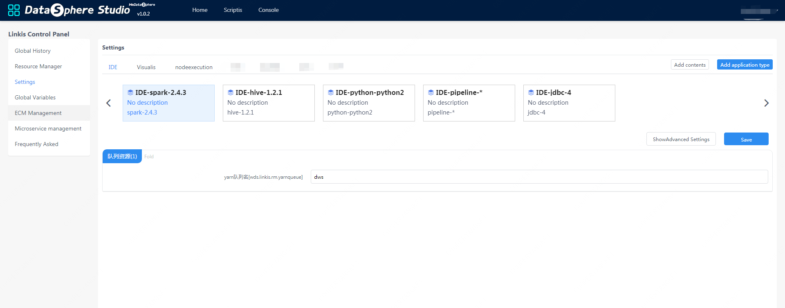
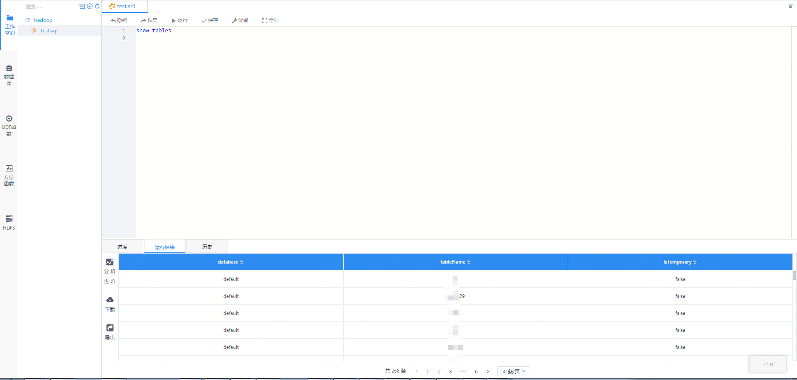
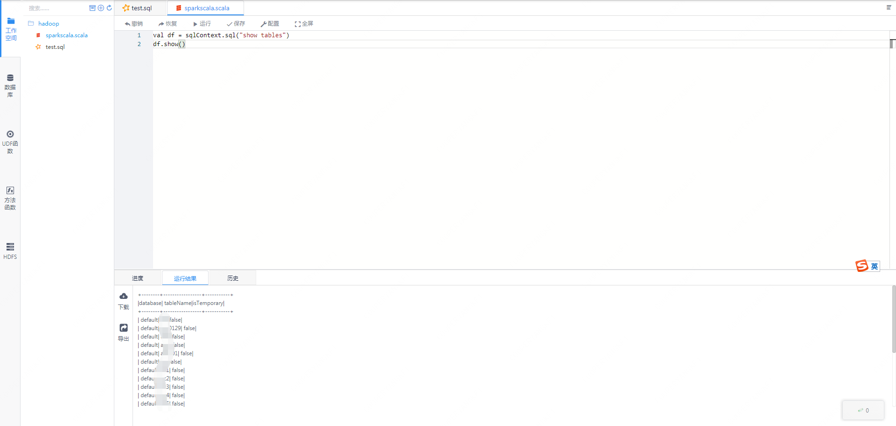
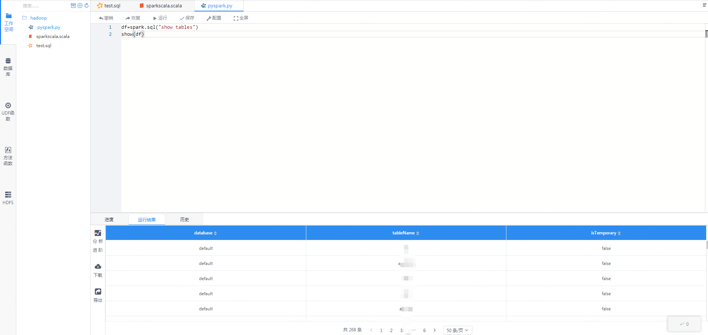
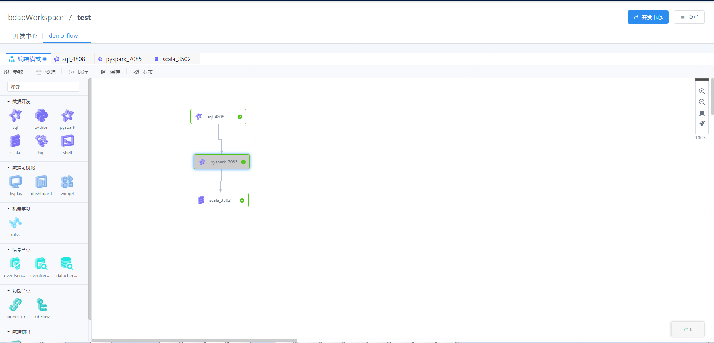
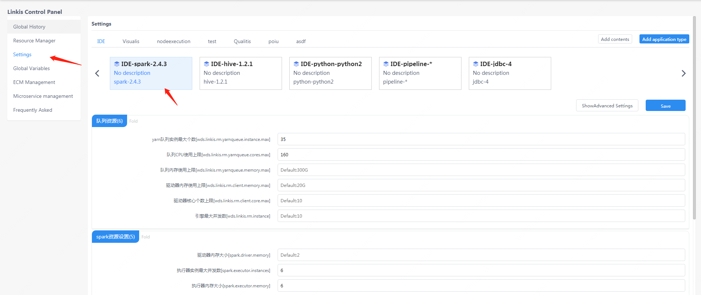

# Spark engine usage documentation

This article mainly introduces the configuration, deployment and use of spark engine in Linkis1.0.

## 1. Environment configuration before using Spark engine

If you want to use the spark engine on your server, you need to ensure that the following environment variables have been set correctly and that the user who started the engine has these environment variables.

It is strongly recommended that you check these environment variables of the executing user before executing spark tasks.

| Environment variable name | Environment variable content | Remarks |
|---------------------------|------------------------------|------|
| JAVA_HOME | JDK installation path | Required |
| HADOOP_HOME | Hadoop installation path | Required |
| HADOOP_CONF_DIR | Hadoop configuration path | Required |
| HIVE\_CONF_DIR | Hive configuration path | Required |
| SPARK_HOME | Spark installation path | Required |
| SPARK_CONF_DIR | Spark configuration path | Required |
| python | python | Anaconda's python is recommended as the default python |

Table 1-1 Environmental configuration list

## 2. Configuration and deployment of Spark engine

### 2.1 Selection and compilation of spark version

In theory, Linkis1.0 supports all versions of spark2.x and above. Spark 2.4.3 is the default supported version. If you want to use your spark version, such as spark2.1.0, you only need to modify the version of the plug-in spark and then compile it. Specifically, you can find the linkis-engineplugin-spark module, change the \<spark.version\> tag to 2.1.0, and then compile this module separately.

### 2.2 spark engineConn deployment and loading

If you have already compiled your spark engine plug-in has been compiled, then you need to put the new plug-in to the specified location to load, you can refer to the following article for details

https://github.com/WeBankFinTech/Linkis/wiki/EngineConnPlugin%E5%BC%95%E6%93%8E%E6%8F%92%E4%BB%B6%E5%AE%89%E8%A3%85%E6%96%87%E6%A1%A3

### 2.3 tags of spark engine

Linkis1.0 is done through tags, so we need to insert data in our database, the way of inserting is shown below.

https://github.com/WeBankFinTech/Linkis/wiki/EngineConnPlugin%E5%BC%95%E6%93%8E%E6%8F%92%E4%BB%B6%E5%AE%89%E8%A3%85%E6%96%87%E6%A1%A3\#22-%E7%AE%A1%E7%90%86%E5%8F%B0configuration%E9%85%8D%E7%BD%AE%E4%BF%AE%E6%94%B9%E5%8F%AF%E9%80%89

## 3. Use of spark engine

### Preparation for operation, queue setting

Because the execution of spark is a resource that requires a queue, the user must set up a queue that he can execute before executing.

Figure 3-1 Queue settings

### 3.1 How to use Scriptis

The use of Scriptis is the simplest. You can directly enter Scriptis and create a new sql, scala or pyspark script for execution.

The sql method is the simplest. You can create a new sql script and write and execute it. When it is executed, the progress will be displayed. If the user does not have a spark engine at the beginning, the execution of sql will start a spark session (it may take some time here),
After the SparkSession is initialized, you can start to execute sql.

Figure 3-2 Screenshot of the execution effect of sparksql

For spark-scala tasks, we have initialized sqlContext and other variables, and users can directly use this sqlContext to execute sql.

Figure 3-3 Execution effect diagram of spark-scala

Similarly, in the way of pyspark, we have also initialized the SparkSession, and users can directly use spark.sql to execute SQL.

Figure 3-4 pyspark execution mode

### 3.2 How to use workflow

DSS workflow also has three spark nodes. You can drag in workflow nodes, such as sql, scala or pyspark nodes, and then double-click to enter and edit the code, and then execute in the form of workflow.

Figure 3-5 The node where the workflow executes spark

### 3.3 How to use Linkis Client

Linkis also provides a client method to call spark tasks, the call method is through the SDK provided by LinkisClient. We provide java and scala two ways to call, the specific usage can refer to <https://github.com/WeBankFinTech/Linkis/wiki/Linkis1.0%E7%94%A8%E6%88%B7%E4 %BD%BF%E7%94%A8%E6%96%87%E6%A1%A3>.

## 4. Spark engine user settings

In addition to the above engine configuration, users can also make custom settings, such as the number of spark session executors and the memory of the executors. These parameters are for users to set their own spark parameters more freely, and other spark parameters can also be modified, such as the python version of pyspark.

Figure 4-1 Spark user-defined configuration management console
