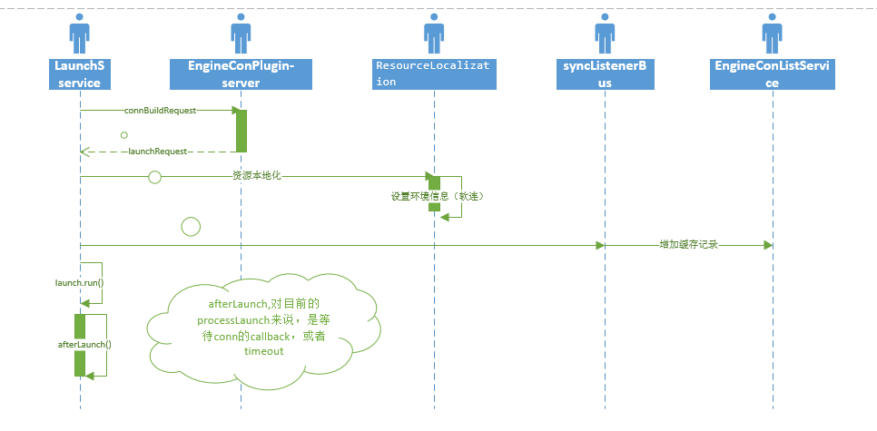

EngineConnManager架构设计
-------------------------

Linkis1.0.0的EngineConnManager（简称ECM），主要聚焦于以下3个能力：

一、 和Linkis Manager的AM的交互

ECM服务启动的时候会去AM中注册

ECM服务关闭的时候，回去AM中注销信息

定时发送心跳信息给AM

二、和EngineConn-Plugin-Server的交互

当创建引擎的请求进来后，ecm会将请求转发给engineConn-plugin-server，获取到

三、和EngineConn的交互

EngineConn启动后会发送pidcallback给ecm去更新相关的EngineConn信息

EngineConn在特殊情况下也会发送日志信息给ECM

ECM在接收到kill请求的情况下，会尝试发送信息给EngineConn让其自杀

### ECM架构

ECM0.X，主要提供了注册、申请Engine资源、引擎管理、引擎创建的能力。

ECM0.X在EngineLaunch方面还不够强大，完全交由EngineCreator模块负责，且比较难支持容器化，与K8S集成则更加麻烦。

ECM0.X的架构图，如下图：

Linkis1.0.0之后，由于ResourceRequestor、EngineCreator已经交给了EngineConnPlugin模块，ECM1.0.0只负责解析由Linkis
Manager传递过来的LaunchEngineRequest，并通过EngineLaunch启动一个新的引擎。

ECM1.0.0还增加了定时负载汇报、本地目录定时检测和清理的功能，所有的资源文件和用户Jar都将交由BmlResourceLocalizationService负责，整个架构变得更加的立体，EngineLaunch还预留了集成容器化和K8S的接口，方便后续的对接。

### 组件说明

#### MetricService

主要用于统计EngineConn的指标，主要有：
starting，running，success，failed状态EngineConn的个数

#### HealthReportService

主要职责：获取当前节点的cpu，内存，磁盘信息，判断当前节点是否健康，定时给AM回报心跳

#### RegisterService

主要职责：服务启动去AM注册，服务注销去AM注销

#### CallbackService

主要职责：负责EngineConn的callback请求，然后给EngineConnList中对应的EngineConn赋值

#### ResourceLocalizationService

主要职责：将资源下载到本地，封装ECM En对象

#### LocalDirsHandleService

主要职责：获取本地化资源的目录文件目录

#### EngineConnListService

主要职责：缓存、并管理该ECM创建的所有EngineConn

#### LaunchService

主要职责： 创建EngineConn 并且等待EngineConn的callback，后面将Node信息返回给AM

### 创建EngineConn请求流程

>   
