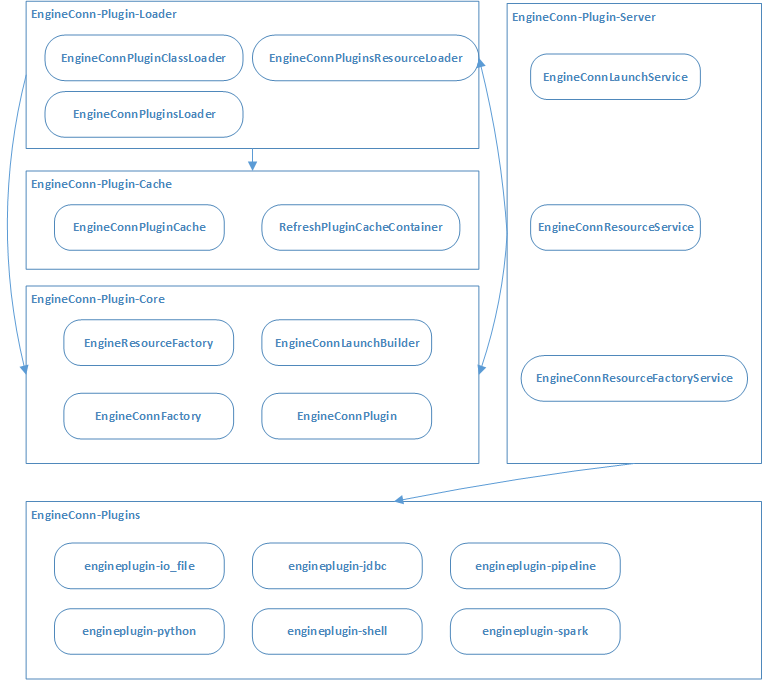
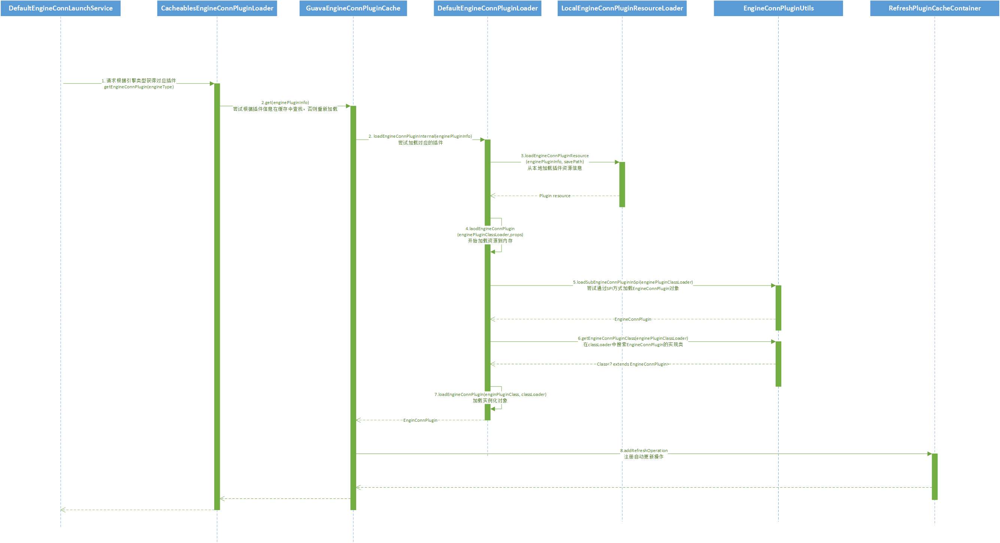
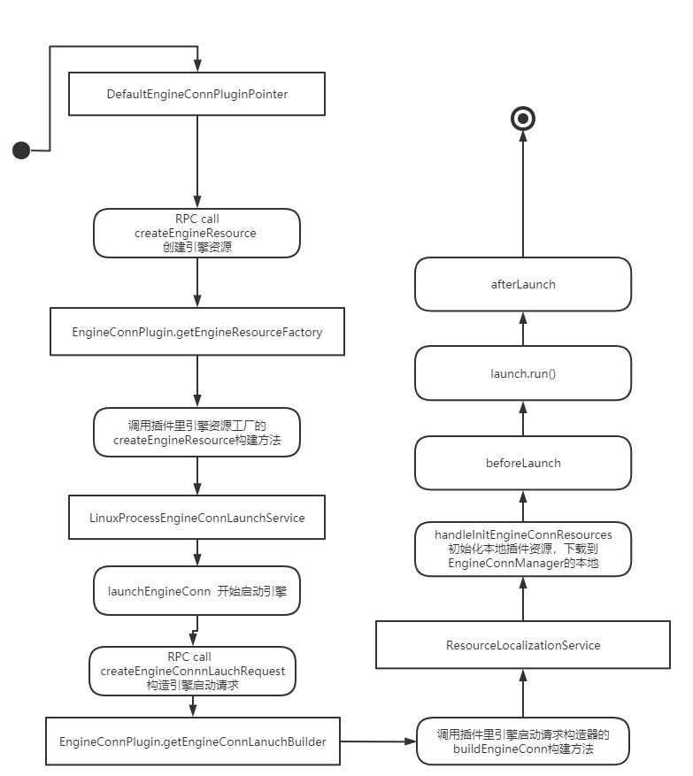

## EngineConnPlugin 架构设计

#### 简述
为了能让开发用户自由扩展Linkis的Engine引擎，并动态加载引擎依赖避免版本冲突，设计研发了EngineConnPlugin架构，允许以实现既定的插件化接口的方式引入新引擎到计算中间件的执行生命周期里，
插件化接口对引擎的定义做了拆解，包括参数初始化、分配引擎资源，构建引擎连接以及设定引擎默认标签。  

### 整体架构示意

  

#### 架构说明
- EngineConn-Plugin-Loader: 引擎插件加载模组，加载流程主要由两部分组成：1）插件资源例如主程序包和程序依赖包等加载到本地(未开放)。2）插件资源从本地动态加载入服务进程环境中，例如通过类加载器加载入JVM虚拟机。
- EngineConn-Plugin-Cache: 引擎插件缓存模组，已经加载进服务进程的插件会被连同其类加载器一起缓存起来，避免多次加载影响效率；同时缓存模组会定时通知加载器去更新插件资源，如果发现有变动，会重新加载并自动刷新缓存。
- EngineConn-Plugin-Server: 引擎插件对外提供RPC服务的模组，成功注册加载的引擎插件会包含资源分配和启动参数配置的逻辑，在引擎初始化过程中，`EngineConn Manager`等其他服务通过RPC请求调用Plugin Server里对应插件的逻辑。

一个EngineConnPlugin接口的结构如下:

| method sign | parameters | responsibility |
| --- | --- | --- |
| `init` | `map[String, Any]` | 初始化插件，传入预设参数 |
| `getEngineResourceFactory` | `无` | 创建并获得引擎资源工厂实例 |
| `getEngineConnLaunchBuilder` | `无` | 创建并获得引擎驱动请求构造器 |
| `getEngineConnFactory` | `无` | 创建并获得引擎连接工厂实例 |
| `getDefaultLabels` | `无` | 获得引擎插件的默认标签 |

EngineConnPlugin架构中涉及如下的流程设计：

#### 一、EngineConnPlugin插件加载  
引擎插件加载采用懒加载配合自动刷新的方式，引擎插件服务启动的时候并不会加载所有的插件，仅扫描校验本地插件目录是否合规或有变动，从而创建或更新BML服务上的插件文件。
只有当第一次接收到启动引擎请求的时候才会根据引擎类型尝试从本地目录读取加载(可以先从BML服务中下载到本地，但此功能处于调试未开放中)，然后再进行载入操作：

#### 二、EngineConnPlugin加入引擎启动生命周期  
引擎启动时，会按次序调用EnginConnPlugin的方法，达到加入新引擎的作用：  
