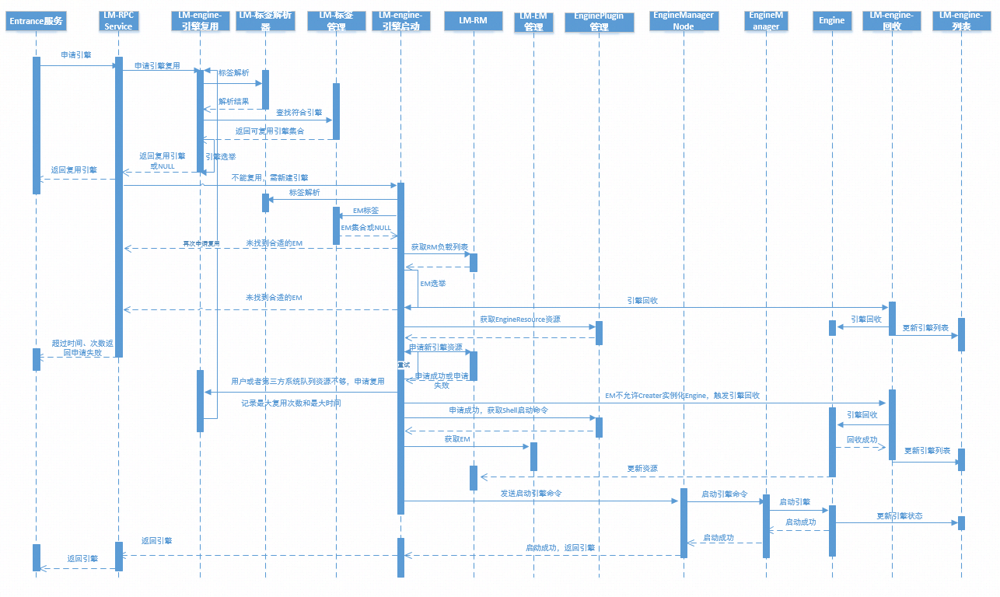

## 背景
针对旧版本Linkis的Entrance模块负责太多的职责，对Engine的管理能力较弱，且不易于后续的扩展，新抽出了AppManager模块，完成
以下职责：
1. 新增AM模块将Entrance之前做的管理Engine的功能移动到AM模块
2. AM需要支持操作Engine，包括：新增、复用、回收、预热、切换等功能
3. 需要对接Manager模块对外提供Engine的管理功能：包括Engine状态维护、引擎列表维护、引擎信息等
4. AM需要管理EM服务，需要完成EM的注册并将资源注册转发给RM进行EM的资源注册
5. AM需要对接Label模块，包括EM/Engine的增删需要通知标签管理器进行标签更新
6. AM另外需要对接标签模块进行标签解析，并需要通过一系列标签获取一些列打好分的serverInstance列表（？EM和Engine怎么区分，1、标签完全不一样）
7. 需要对外提供基础接口：包括引擎和引擎管理器的增删改，提供metric查询等

## 架构图

如上图所示：AM在LinkisMaster中属于AppManager模块，作为一个Service提供服务

新引擎申请流程图：

从上面的引擎生命周期流程图可知，Entrance已经不在做Engine的管理工作，engine的启动和管理都由AM控制，那么在这一过程中。Entrance需要去掉部分代码包括：

## 架构说明：
AppManager主要包含了引擎服务和EM 服务：

引擎创建：专门负责LinkisManager服务的新建引擎功能，引擎启动模块完全负责一个新引擎的创建，包括获取ECM标签集合、资源申请、获得引擎启动命令，通知ECM新建引擎，更新引擎列表等。
CreateEngienRequest->RPC/Rest -> MasterEventHandler ->CreateEngineService ->
->LabelContext/EnginePlugin/RMResourcevice->（RcycleEngineService）EngineNodeManager->EMNodeManager->sender.ask(EngineLaunchRequest)->EngineManager服务->EngineNodeManager->EngineLocker->Engine->EngineNodeManager->EngineFactory=&gt;EngineService=&gt;ServerInstance
在创建引擎是存在和RM交互的部分，EnginePlugin应该需要通过Lables返回具体的资源类型，然后AM向RM发送资源请求

引擎复用：为了减少引擎启动所耗费的时间和资源，引擎使用必须优先考虑复用原则，复用一般是指复用用户已经创建好的引擎，引擎复用模块负责提供可复用引擎集合，选举并锁定引擎后开始使用，或者返回没有可以复用的引擎。
ReuseEngienRequest->RPC/Rest -> MasterEventHandler ->ReuseEngineService ->
->abelContext->EngineNodeManager->EngineSelector->EngineLocker->Engine->EngineNodeManager->EngineReuser->EngineService=&gt;ServerInstance

引擎切换：主要是指对已有引擎进行标签切换，例如创建引擎的时候是由Creator1创建的，现在可以通过引擎切换改成Creator2。这个时候就可以允许当前引擎接收标签为Creator2的任务了。
SwitchEngienRequest->RPC/Rest -> MasterEventHandler ->SwitchEngineService ->LabelContext/EnginePlugin/RMResourcevice->EngineNodeManager->EngineLocker->Engine->EngineNodeManager->EngineReuser->EngineService=&gt;ServerInstance

引擎管理器：引擎管理负责管理所有引擎的基本信息、元数据信息

ECM管理：负责所有EngineManager的信息管理，可以在线上对ECM进行服务管理，包括标签修改，暂停ECM服务，获取ECM实例信息，获取ECM运行的引擎信息，kill掉ECM操作。
