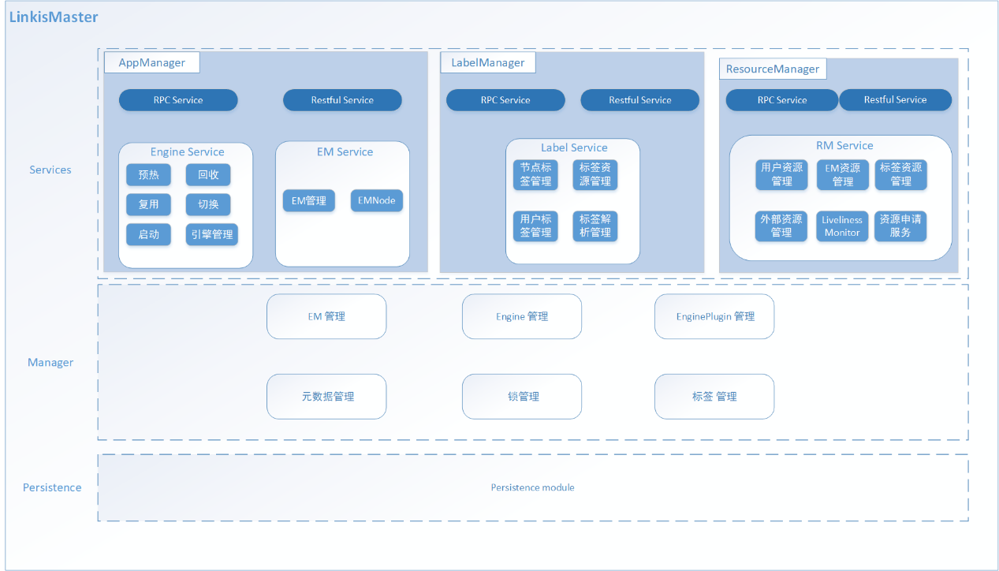
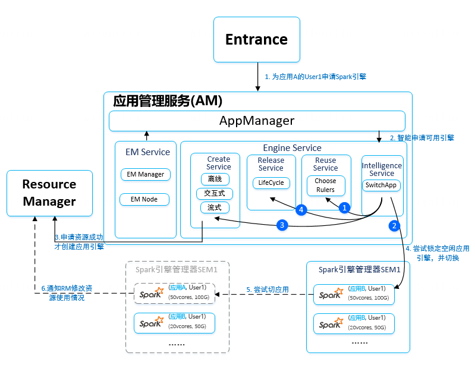
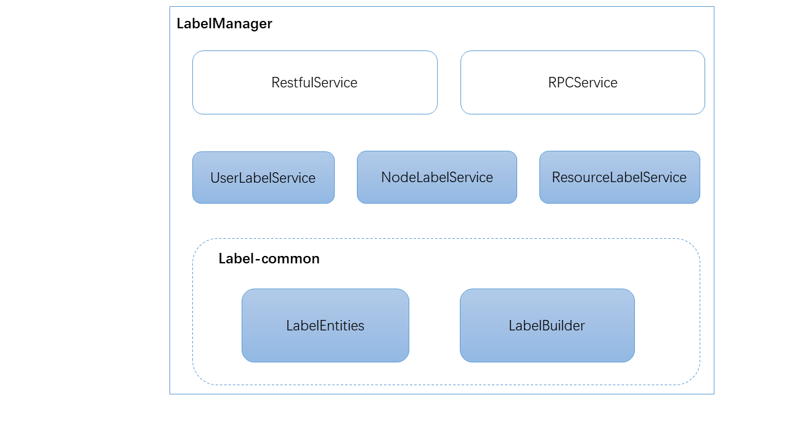
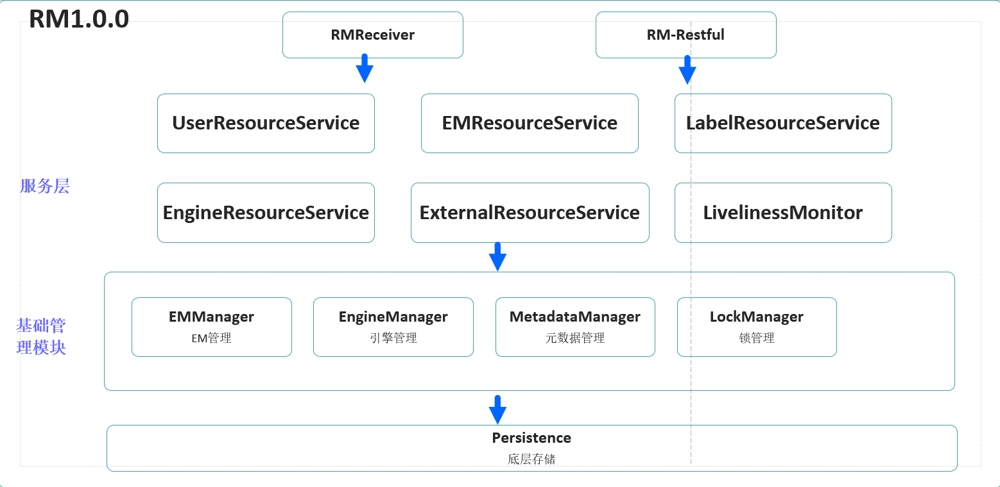

LinkisManagerj架构设计
====================

## 一. 背景
LinkisManager作为Linkis的一个独立微服务，对外提供了AppManager（应用管理）、ResourceManager（资源管理）、LabelManager（标签管理）的能力，能够支持多活部署，具备高可用、易扩展的特性。

### 1. 名词解释

- EngineConnManager： 引擎管理器，用于启动和管理引擎
- EngineConn：引擎连接器，用于连接底层计算引擎

## 二. 架构图

## 三. 架构说明

### 1. 应用管理模块-AppManager

-   新增一个AppManager模块，专门负责引擎的调度管理。

-   AppManager将统筹管理所有的EngineConnManager和EngineConn，EngineConn的申请、复用、创建、切换、销毁等生命周期全交予AppManager进行管理；

-   ECMNode是EngineConnManager在LinkisManager中的对应对象，专门负责ECM在LinkisManager的处理，相当于一个ECM的远程句柄。

AppManager架构图如下：

  
### 2. 标签管理模块-LabelManager

标签管理模块，是LinkisManager非常核心的一个模块，其主要功能如下：

-   为Engine和EM打标签，提供基于节点的标签增删改查能力

-   为一些特定的标签，提供资源管理能力，协助RM在资源管理层面更加精细化

-   为用户提供标签能力。为一些用户打上标签，这样在引擎申请时，会自动加上这些标签判断

-   提供标签解析模块，能将用户的请求，解析成一堆标签。

LabelManager架构图如下：

### 3. 资源管理模块-ResourceManager

ResourceManager用于管理引擎和队列的所有资源分配，有如下特点：

-   RM1.0.0，在对用户资源、EM资源方面，已经能够做到很好的管理。

-   支持基于复杂标签场景下的资源管理。

-   对RM1.0.0进行了重构，分层更加清晰和合理，加上对标签化的支持，使得RM能够与AM有机整合一体，合并为Linkis的Manager服务。

-   EM也增加负载上报的功能，使得AM实现对EM的限流和负载均衡变得非常的简单

ResourceManager架构图如下：

