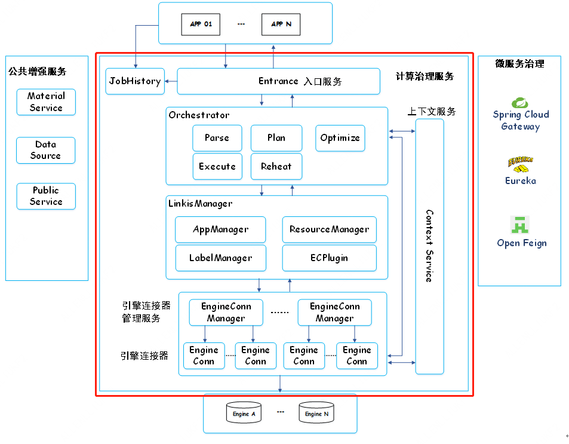
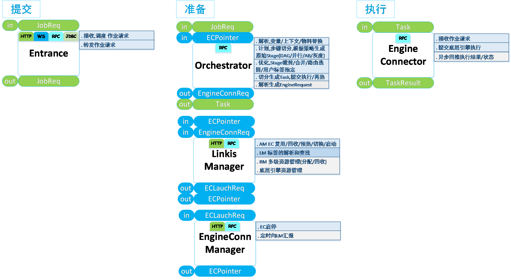

## **背景**

**Linkis0.X的架构主要存在以下问题**

1.核心处理流程和层级模块边界模糊

-   Entrance 和 EngineManager 功能边界模糊

-   任务提交执行主流程不够清晰

-   扩展新引擎较麻烦，需要实现多个模块的代码

-   只支持计算请求场景，存储请求场景和常驻服务模式（Cluster）难以支持

2.更丰富强大计算治理功能需求

-   计算任务管理策略支持度不够

-   标签能力不够强大，制约计算策略和资源管理

Linkis1.0计算治理服务的新架构可以很好的解决这些问题。

## **架构图**

**作业流程优化：**
Linkis1.0将优化Job的整体执行流程，从提交 —\> 准备 —\>
执行三个阶段，来全面升级Linkis的Job执行架构，如下图所示：

## **架构说明**

### 1、Entrance

 Entrance作为计算类型任务的提交入口，提供任务的接收、调度和Job信息的转发能力，是从Linkis0.X的Entrance拆分出来的原生能力；
 
 [进入Entrance架构设计]()

### 2、Orchestrator

 Orchestrator 作为准备阶段的入口，从 Linkis0.X 的 Entrance 继承了解析Job、申请Engine和提交执行的能力；同时，Orchestrator将提供强大的编排和计算策略能力，满足多活、主备、事务、重放、限流、异构和混算等多种应用场景的需求。
 
 [进入Orchestrator架构设计]()

### 3、LinkisManager

 LinkisManager作为Linkis的管理大脑，主要由AppManager、ResourceManager、LabelManager和EngineConnPlugin组成。
 
 1. ResourceManager 不仅具备 Linkis0.X 对 Yarn 和 Linkis EngineManager的资源管理能力，还将提供基于标签的多级资源分配和回收能力，让ResourceManager具备跨集群、跨计算资源类型的全资源管理能力；
 2. AppManager 将统筹管理所有的 EngineConnManager 和 EngineConn，EngineConn 的申请、复用、创建、切换、销毁等生命周期全交予 AppManager 进行管理；而 LabelManager 将基于多级组合标签，提供跨IDC、跨集群的 EngineConn 和 EngineConnManager 路由和管控能力；
 3. EngineConnPlugin 主要用于降低新计算存储的接入成本，真正做到让用户只需要实现一个类，就能接入一个全新的计算存储引擎。

 [进入LinkisManager架构设计](./LinkisManager/README.md)

### 4、EngineConnManager

 EngineConnManager (简称ECM)是 Linkis0.X EngineManager 的精简升级版。Linkis1.0下的ECM去除了引擎的申请能力，整个微服务完全无状态，将聚焦于支持各类 EngineConn 的启动和销毁。
 
 [进入EngineConnManager架构设计](./EngineConnManager/README.md)

### 5、EngineConn

EngineConn 是 Linkis0.X Engine 的优化升级版本，将提供 EngineConn 和 Executor 两大模块，其中 EngineConn 用于连接底层的计算存储引擎，提供一个打通了底层各计算存储引擎的 Session 会话；Executor 则基于这个 Session 会话，提供交互式计算、流式计算、离线计算、数据存储的全栈计算能力支持。

[进入EngineConn架构设计](./EngineConn/README.md)
