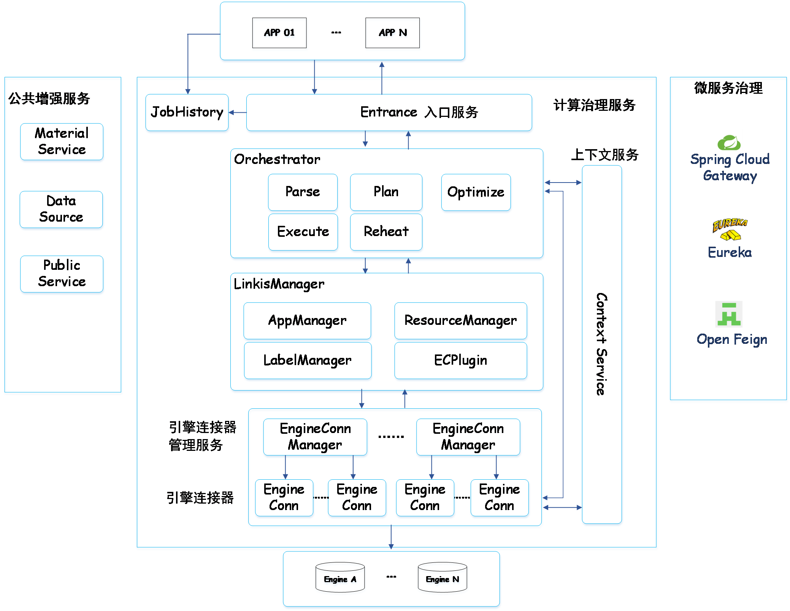

## **Linkis1.0 架构特点**

##  **架构图**

##  **主要特点：**

1.  **强化计算治理**，Linkis1.0主要从引擎管理、标签管理、ECM管理和资源管理等几个方面，全面强化了计算治理的综合管控能力，基于标签化的强大管控设计理念，使得Linkis1.0向多IDC化、多集群化、多容器化，迈出了坚实的一大步。

2.  **简化用户实现新引擎**，EnginePlugin用于将原本实现一个新引擎，需要实现的相关接口和类，以及需要拆分的Entrance-EngineManager-Engine三层模块体系，融合到了一个接口之中，简化用户实现新引擎的流程和代码，真正做到只要实现一个类，就能接入一个新引擎。

3.  **全栈计算存储引擎支持**，实现对计算请求场景（如Spark）、存储请求场景（如HBase）和常驻集群型服务（如SparkStreaming）的全面覆盖支持。

4.  **高级计算策略能力改进**，新增Orchestrator实现丰富计算任务管理策略，且支持基于标签的解析和编排。

5.  **安装部署改进**  优化一键安装脚本，支持容器化部署，简化用户配置。
