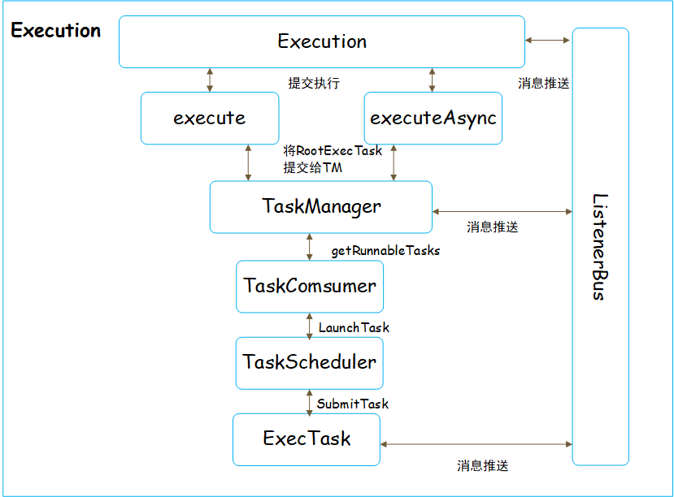
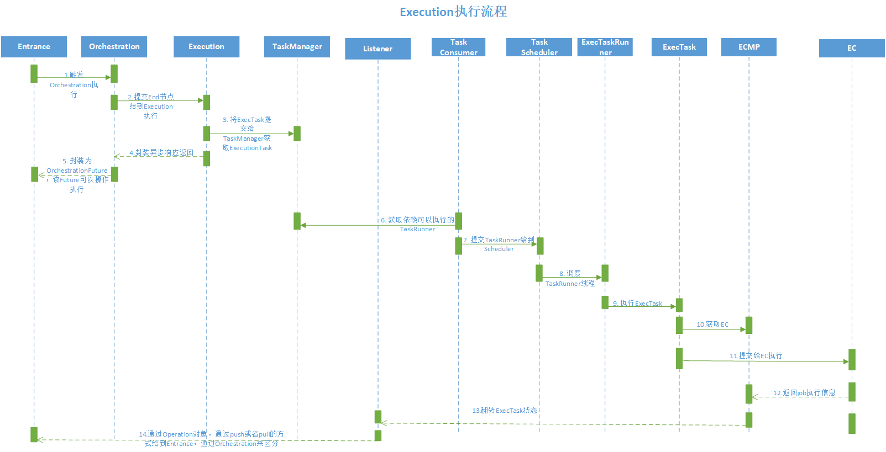

Orchestrator-Execution架构设计
===

## 一. Execution概念
&nbsp;&nbsp;&nbsp;&nbsp;&nbsp;Orchestrator-Execution模块是Orchestrator的执行模块，用于调度执行编排后的PhysicalTree，在执行的时候会从JobEndExecTask开始进行依赖执行。Execution的调用有Orchestration的执行和异步执行发起，然后Execution负责调度执行RootExecTask（PhysicalTree的根节点）整合树的ExecTask运行，并封装所有execTask的执行响应进行返回。执行采用生产者消费者异步执行模式进行运行。

## 二. Execution架构
&nbsp;&nbsp;&nbsp;&nbsp;&nbsp;Execution在接受到RootExecTask执行后，会将RootExecTask给到TaskManager进行调度执行（生产），然后TaskComsumer会从TaskManager获取现在可以依赖执行的任务进行消费执行，拿到可以运行的ExecTask后会提交给TaskScheduler进行提交执行。

不管是异步执行和同步执行，都是通过上面的流程进行调度异步执行，同步执行会调用ExecTask的waitForCompleted方法，完成同步响应获取。整个执行过程中ExecTask的状态、结果集、日志等信息通过ListenerBus进行投递和通知。

## 三. Execution整体流程
&nbsp;&nbsp;&nbsp;&nbsp;&nbsp;Execution的整体执行流程如下所示，下图已交互式执行（ComputationExecution）流程为例：

