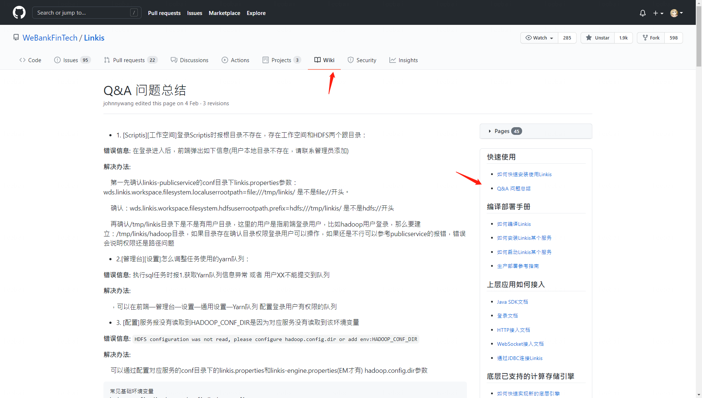

Linkis1.0安装部署介绍
====

目录
----

[一、	安装目录结构	](#安装目录结构)

[二、	配置项修改	](#配置项修改)

[三、	微服务启停	](#微服务启停)

[四、    多活部署方案介绍	](#多活部署方案介绍)

>   [1、多节点部署方式参考	](#多节点部署方式参考)

>   [2、Linkis微服务分布式部署配置参数	](#Linkis微服务分布式部署配置参数)

[五、	异常问题排查思路	](#异常问题排查思路)

>   [1、如何进行异常日志定位	](#如何进行异常日志定位)

>   [2、社区issue专栏搜索关键词	](#社区issue专栏搜索关键词)

>   [3、社区文档《Q&A问题总结》	](#社区文档《Q&A问题总结》)

>   [4、定位系统日志	](#定位系统日志)

>   [5、社区用户群咨询交流	](#社区用户群咨询交流)

>   [6、定位源码远程debug	](#定位源码远程debug)

Linkis1.0的目录结构与0.X版本相差巨大，0.X的每个微服务都时独立存在的一个根目录，这种目录结构带来的主要的好处是易于区分微服务，便于单个的微服务进行管理，但也存在着一些很明显的问题：

1.  微服务目录过于繁杂，切换目录管理不够方便

2.  没有统一的启动脚本，导致微服务启停比较麻烦

3.  存在大量重复的服务配置，同一个配置经常需要修改多处

4.  存在大量重复的Lib依赖，增大了安装包的体积和依赖冲突的风险

因此Linkis1.0中，我们对安装目录结构做了极大程度的优化和调整，减少了微服务目录的数量，降低了重复依赖的jar包，尽可能复用了配置文件和微服务管理脚本，主要体现在以下几个方面：

1.  不再为每个微服务提供bin文件夹，修改为所有微服务共用。

    Bin文件夹修改为安装目录，主要用于安装Linkis1.0和检查环境状态，新增sbin目录，为Linkis提供一键启停，依靠变更参数的方式为所有微服务提供单独启停。

2.  不再为每个微服务单独提供conf目录，修改为所有微服务共用。

    Conf文件夹包含两个方面的内容，一方面是所有微服务共用的配置信息，这类配置信息里面包含了用户根据自身环境自定义配置的信息；另一方面是各个微服务的各自的特殊配置，一般情况下用户不需要自行更改。

3.  不再为每个微服务提供lib文件夹，修改为所有微服务共用

    Lib文件夹中同样包含了两个方面的内容，一方面是所有微服务都需要的公共依赖；另一方面是各个微服务各自需要的特殊依赖。

4.  不再为每个微服务提供log目录，修改为所有微服务共用

    Log目录中包含了所有微服务的日志文件。

# 安装目录结构

Linkis1.0简化后的目录结构如下，其中加粗标注地为用户安装使用时的必定会使用的目录项其他目录项初次使用无特殊情况无需关心：

├── bin 安装目录  
│ ├── checkEnv.sh ── 环境变量检测  
│ ├── checkServices.sh ── 微服务状态检测  
│ ├── common.sh ── 部分公共shell函数  
│ ├── install-io.sh ── 用于安装时的依赖替换  
│ └── **install.sh** ── **Linkis安装的主脚本**  
├── conf 配置目录  
│ ├── **db.sh**       ──**mysql数据库配置**  
│ ├── linkis-computation-governance ──计算治理模块配置  
│ ├── **linkis-env.sh**     ──**Linkis依赖环境配置**  
│ ├── linkis.properties ──Linkis执行环境配置  
│ ├── linkis-public-enhancements ──公共增强服务模块配置  
│ └── linkis-spring-cloud-services ──SpringCloud环境配置  
├── db 数据库DML和DDL文件目录  
│ ├── linkis_ddl.sql ──数据库表定义SQL  
│ ├── linkis_dml.sql ──数据库表初始化SQL  
│ └── module ──包含各个微服务的DML和DDL文件  
├── lib lib目录  
│ ├── linkis-commons ──公共依赖包  
│ ├── linkis-computation-governance ──计算治理模块的lib目录  
│ ├── linkis-engineconn-plugins ──所有引擎插件的lib目录  
│ ├── linkis-public-enhancements ──公共增强服务的lib目录  
│ └── linkis-spring-cloud-services ──SpringCloud的lib目录  
├── logs 日志目录  
│ ├── linkis-computation-governance ──计算治理模块所有微服务日志  
│ ├── linkis-public-enhancements ──公共增强模块所有微服务日志  
│ └── linkis-spring-cloud-services ──SpringCloud模块微服务日志  
├── pid 所有微服务的进程ID  
│ ├── linkis_cg-engineconnmanager.pid ──引擎管理器微服务  
│ ├── linkis_cg-engineplugin.pid ──引擎插件微服务  
│ ├── linkis_cg-entrance.pid ──引擎入口微服务  
│ ├── linkis_cg-linkismanager.pid ──linkis管理器微服务  
│ ├── linkis_mg-eureka.pid ──eureka微服务  
│ ├── linkis_mg-gateway.pid ──gateway微服务  
│ ├── linkis_ps-bml.pid ──物料库微服务  
│ ├── linkis_ps-cs.pid ──上下文微服务  
│ ├── linkis_ps-datasource.pid ──数据源微服务  
│ └── linkis_ps-publicservice.pid ──公共微服务  
├── sbin 微服务启停脚本目录  
│ ├── ext ──各个微服务的启停脚本目录  
│ ├── **linkis-daemon.sh**    ──**快捷启停、重启单个微服务脚本  
│ ├── **linkis-start-all.sh**    ──**一键启动全部微服务脚本  
└ ├── **linkis-stop-all.sh**    ──**一键停止全部微服务脚本**

# 配置项修改

在执行完bin目录下的install.sh完成Linkis安装后，需要进行配置项修改，所有配置项位于con目录下，通常情况下需要修改db.sh、linkis.properties、linkis-env.sh三个配置文件，项目安装和配置可以参考文章《Linkis1.0安装》

# 微服务启停

>   修改完配置项之后即可在sbin目录下启动微服务，所有微服务名称如下：

>   ├── linkis-cg-engineconnmanager 引擎管理服务  
>   ├── linkis-cg-engineplugin 引擎插件管理服务  
>   ├── linkis-cg-entrance 计算治理入口服务  
>   ├── linkis-cg-linkismanager 计算治理管理服务  
>   ├── linkis-mg-eureka 微服务注册中心服务  
>   ├── linkis-mg-gateway Linkis网关服务  
>   ├── linkis-ps-bml 物料库服务  
>   ├── linkis-ps-cs 上下文服务  
>   ├── linkis-ps-datasource 数据源服务  
>   └── linkis-ps-publicservice 公共服务

>   **微服务简称**：

| 简称 | 英文全称                | 中文全称   |
|------|-------------------------|------------|
| cg   | Computation Governance  | 计算治理   |
| mg   | Microservice Covernance | 微服务治理 |
| ps   | Public Service          | 公共服务   |

以往启停单个微服务需要进入到各个微服务的bin目录下，执行start/stop脚本，在微服务较多的情况下启停比较麻烦，增加了很多额外的切换目录操作，Linkis1.0将所有的微服务启停相关的脚本放置在了sbin目录下，只需要执行单个入口脚本即可。

>   **在Linkis/sbin目录下**：

1.  一次性启动所有微服务：

    sh linkis-start-all.sh

2.  一次性关停所有微服务

    sh linkis-stop-all.sh

3.  启动单个微服务（服务名需要去掉linkis前缀如：mg-eureka）

    sh linkis-daemon.sh start service-name

    例如: sh linkis-daemon.sh start mg-eureka

4.  关闭单个微服务

    sh linkis-daemon.sh stop service-name

    例如: sh linkis-daemon.sh stop mg-eureka

5.  重启单个微服务

    sh linkis-daemon.sh restart service-name

    例如: sh linkis-daemon.sh restart mg-eureka

6.  查看单个微服务的状态

    sh linkis-daemon.sh status service-name

    例如: sh linkis-daemon.sh status mg-eureka

# 多活部署方案介绍

Linkis的单机部署方式简单，但是不能用于生产环境，因为过多的进程在同一个服务器上会让服务器压力过大。
部署方案的选择，和公司的用户规模、用户使用习惯、集群同时使用人数都有关，一般来说，我们会以使用Linkis的同时使用人数和用户对执行引擎的偏好来做依据进行部署方式的选择。

### 多节点部署方式参考

Linkis1.0仍然保持着基于SpringCloud的微服务架构，其中每个微服务都支持多活的部署方案，当然不同的微服务在系统中承担的角色不一样，有的微服务调用频率很高，更可能会处于高负荷的情况，**在安装EngineConnManager的机器上，由于会启动用户的引擎进程，机器的内存负载会比较高，其他类型的微服务对机器的负载则相对不会很高，**对于这类微服务我们建议启动多个进行分布式部署，Linkis动态使用的总资源可以按照如下方式计算。

**EngineConnManager**使用总资源 = 总内存 + 总核数 =

**同时在线人数 \* (所有类型的引擎占用内存) \*单用户最高并发数+ 同时在线人数 \*
(所有类型的引擎占用内存) \*单用户最高并发数**

例如只使用spark、hive、python引擎且单用户最高并发数为1的情况下，同时使用人数50人，Spark的Driver内存1G，Hive
Client内存1G，python client 1G，每个引擎都使用1个核，那么就是 50 \*（1+1+1）G \*
1 + 50 \*(1+1+1)核\*1 = 150G 内存 + 150 CPU核数。

分布式部署时微服务本身占用的内存可以按照每个2G计算，对于使用人数较多的情况下建议调大ps-publicservice的内存至6G，同时建议预留10G内存作为buffer。

以下配置假设**每个用户同时启动两个引擎为例**，**对于64G内存的机器**，参考配置如下：

-   同时在线人数10-50

    **服务器配置推荐**4台服务器，分别命名为S1,S2,S3,S4

| Service              | Host name | Remark           |
|----------------------|-----------|------------------|
| cg-engineconnmanager | S1、S2    | 每台机器单独部署 |
| Other services       | S3、S4    | Eureka高可用部署 |

-   同时在线人数50-100

    **服务器配置推荐**:6台服务器，分别命名为S1,S2,S3,S4,S5,S6

| Service              | Host name | Remark           |
|----------------------|-----------|------------------|
| cg-engineconnmanager | S1-S4     | 每台机器单独部署 |
| Other services       | S5、S6    | Eureka高可用部署 |

-   同时使用人数 100-300

**服务器配置推荐**:12台服务器，分别命名为S1,S2..S12

| Service              | Host name | Remark           |
|----------------------|-----------|------------------|
| cg-engineconnmanager | S1-S10    | 每台机器单独部署 |
| Other services       | S11、S12  | Eureka高可用部署 |

-   同时使用人数300-500

    **服务器配置推荐**：20台服务器，分别命名为S1,S2..S20

| Service              | Host name | Remark                                                                                       |
|----------------------|-----------|----------------------------------------------------------------------------------------------|
| cg-engineconnmanager | S1-S18    | 每台机器单独部署                                                                             |
| Other services       | S19、S20  | Eureka高可用部署，部分微服务如果请求量上万可以考虑扩容，目前双活部署可以支持行内上千用户使用 |

-   同时使用人数500以上（按照同时在线800人估算）

    **服务器配置推荐**：34台服务器，分别命名为S1,S2..S34

| Service              | Host name | Remark                                                                                       |
|----------------------|-----------|----------------------------------------------------------------------------------------------|
| cg-engineconnmanager | S1-S32    | 每台机器单独部署                                                                             |
| Other services       | S33、S34  | Eureka高可用部署，部分微服务如果请求量上万可以考虑扩容，目前双活部署可以支持行内上千用户使用 |

### Linkis微服务分布式部署配置参数

在linkis1.0中，我们对启动参数进行了优化和整合，各个微服务的部分重要的启动参数都通过conf/linkis-env.sh文件加载，例如微服务IP、端口、注册中心地址等，因此修改参数的方式发生了一点变化，以机器server1，server2双活部署为例，为了让eureka之间相互注册。

在server1的机器上，需要将**conf/linkis-env.sh**中的

```
EUREKA_URL=http://\$EUREKA_INSTALL_IP:\$EUREKA_PORT/eureka/

修改为：

EUREKA_URL=http://\$EUREKA_INSTALL_IP:\$EUREKA_PORT/eureka/,http:/server2:port/eureka/
```

同理，在server2的机器上，需要将**conf/linkis-env.sh**中的

```
EUREKA_URL=http://\$EUREKA_INSTALL_IP:\$EUREKA_PORT/eureka/

修改为：

EUREKA_URL=http://\$EUREKA_INSTALL_IP:\$EUREKA_PORT/eureka/,http:/server1:port/eureka/
```

修改完之后启动微服务，从web端进入eureka注册界面，可以看到已经成功注册到eureka的微服务，并且DS
Replicas也会显示集群相邻的副本节点。


# 异常问题排查思路

在版本发布的准备过程中，我们会尽力提前发现部署和安装方面的问题然后修复，由于每个人部署的环境都有一些差异，我们有时候也没有办法提前预知所有的出现的问题和解决方案。不过由于社区的存在，大家的很多问题都会重合，也许大家遇到的安装部署方面的问题已经有用户发现并解决过，所以对于一些无法自行精确定位的问题，建议的排查级基本思路优先级可以按照：**社区issue专栏搜索关键词—\>在社区查阅《Q\&A问题总结》文档—\>定位系统日志—\>社区用户群咨询交流—\>定位源码远程debug**

### 如何进行异常日志定位

如果某个接口请求报错，我们可以根据接口的返回加过中定位出现问题的微服务，一般情况下可以**根据URL规范进行定位，**Linkis接口中的URL都遵循着一定的设计规范，即**/api/rest_j/v1/{applicationName}/.+的格式**，通过applicationName可以定位应用名，部分应用本身是一个微服务，这时候应用名和微服务名相同，部分应用归属于某个微服务，此时应该通过应用名查找归属的微服务，去对应的微服务下查看log日志，下面给出微服务和应用名的对应关系。

| **ApplicationName**  | **Microservice**     |
|----------------------|----------------------|
| cg-linkismanager     | cg-linkismanager     |
| cg-engineplugin      | cg-engineplugin      |
| cg-engineconnmanager | cg-engineconnmanager |
| cg-entrance          | cg-entrance          |
| ps-bml               | ps-bml               |
| ps-cs                | ps-cs                |
| ps-datasource        | ps-datasource        |
| configuration        | ps-publicservice     |
| instance-label       |                      |
| jobhistory           |                      |
| variable             |                      |
| udf                  |                      |

### 社区issue专栏搜索关键词

在github社区首页，issue专栏留存了社区用户遇到的部分问题和解决方案，非常适合在遇到问题后快速寻找解决方案，在filter过滤器中搜索报错的关键词即可。


### 社区文档《Q\&A问题总结》

在社区Linkis首页的wiki目录下，包含了Linkis安装部署相关文档和架构设计文档，也包含了安装部署过程中常见问题汇总以及解决方案，包含了一些出现频率较高的热点问题。



### 定位系统日志

通常出现错误的情况可以分为三种阶段：安装执行install.sh时报错、启动微服务报错、启动引擎报错。

1.  **执行install.sh时出现错误**，通常有如下几种情况

    1.  环境变量缺失：例如java/python/Hadoop/hive/spark的环境在标准版下需要进行配置，在安装脚本的时候也会进行相应的校验操作，如果遇到这种问题一般都会有很明确的缺少环境变量的提示，例如异常-bash
        spark-submit:command not found等。

    2.  系统版本不匹配：目前Linkis支持Linux大部分版本，对cent
        os版本的兼容性最好，某些系统版本会存在命令不兼容的情况，例如ubantu中对yum的兼容较差，可能会导致安装部署是出现yum相关的报错，此外也建议尽量不要在windows下部署linkis，目前没有脚本完全兼容.bat命令。

    3.  配置项缺失：linkis
        1.0版本需要修改的配置文件有两个，linkis-env.sh和db.sh，

        前者包含了linkis在执行期间需要加载的环境参数，后者是linkis自身需要存储相关表的数据库信息。通常情况下如果缺少对应的配置，报错信息会出现Key值相关的异常，例如db.sh没填写相关数据库配置时，会出现unknow
        mysql server host ‘-P’异常，这是由于host缺失导致的。

2.  **启动微服务报错**

    Linkis将所有微服务的日志文件统一放入了logs目录，日志目录层级如下：

    ├── linkis-computation-governance  
    │ ├── linkis-cg-engineconnmanager  
    │ ├── linkis-cg-engineplugin  
    │ ├── linkis-cg-entrance  
    │ └── linkis-cg-linkismanager  
    ├── linkis-public-enhancements  
    │ ├── linkis-ps-bml  
    │ ├── linkis-ps-cs  
    │ ├── linkis-ps-datasource  
    │ └── linkis-ps-publicservice  
    └── linkis-spring-cloud-services  
    ├── linkis-mg-eureka  
    └── linkis-mg-gateway

    包含计算治理、公共增强、微服务管理三大微服务模块。每个微服务下包含linkis-gc.log、linkis.log、linkis.out三个日志。分别对应服务的GC日志、服务日志、服务的System.out日志。

    通常情况下，启动某个微服务出错时，可以cd到log目录的对应服务内查看相关日志排查问题，一般情况下出现频率最高的问题也可以分为三类：

    1.  **端口占用**：由于Linkis微服务的默认端口大多集中在9000，在启动前需要检查每个微服务的端口是否被其他微服务所占用，如果有占用的情况，需要更改conf/linkis-env.sh文件对应的微服务端口

    2.  **必要的配置参数缺失**：对于某些微服务来说，在启动是必须要加载某些用户自定义参数才能正常启动，例如linkis-cg-engineplugin微服务在启动时会加载conf/linkis.properties中的wds.linkis.engineconn.\*相关的配置，如果用户在安装后对Linkis的路径有更改，不对应修改该配置时，启动linkis-cg-engineplugin微服务就会报错。

    3.  **系统环境不兼容**：建议用户在部署安装时尽量参考官方文档中建议的系统及应用版本，以及安装必要的系统插件，例如expect、yum等，对于应用版本如果不兼容时，可能会引发该应用相关的错误，例如mysql5.7版本中由于SQL语句不兼容可能会导致安装过程中初始化db时，linkis.ddl和linkis.dml文件报错，需要参考《Q\&A问题汇总》或者部署文档进行相应的设置才能解决。

3.  **微服务执行期报错**

    微服务执行期报错的情况比较复杂，遇到的情况也都因环境而异，但排查的方式基本一致，从对应的微服务报错目录出发，我们大致可以分为三种情况：

    1.  **手动安装部署的微服务报错**：该类微服务日志统一放在log/目录下，定位到微服务之后，进入对应目录查看即可。

    2.  **动态启动引擎失败**：资源不足，请求引擎失败：出现该类报错时，不一定是因为资源不足，由于前端只会抓取Spring项目启动后的日志，对于引擎启动前的错误无法很好的抓取。经过内测用户的实际使用过程中发现有三种高频问题：

        a.  **由于没有引擎目录权限无法创建引擎：**日志会打印到**cg-engineconnmanager微服务下的linkis.out**文件中，需要进入该文件查看具体原因。

        b.  **引擎lib包中存在依赖冲突**、**服务器内存资源不足无法正常启动：**由于已经创建了引擎目录，所以日志会打印到引擎下的stdout文件中，引擎路径可以参考c

        c.  **引擎执行期报错**：每个被启动的引擎都是在运行期动态加载启动的微服务，当引擎启动后，出现报错则需要去对应启动用户目录下寻找该引擎对应日志，对应的根路径为安装前**linkis-env**中填写的**ENGINECONN_ROOT_PATH**，如果安装后需要修改该路径，则需要在linkis.properties中修改wds.linkis.engineconn.root.dir。

### 社区用户群咨询交流

对于安装部署过程中按照上述流程定位仍无法解决的问题，可以在我们的社区群中将报错信息发出来，为了方便社区伙伴和开发人员帮助解决，提升效率，**建议您提问时，可以将问题现象、相关日志信息、已经排查过的地方一并发出，如果觉得可能是环境问题，则需要将对应的应用版本也一并列出**，我们提供了微信群和QQ群两种线上交流渠道，具体联系方式可以在Linkis的github首页最下方看到。

### 定位源码远程debug

通常情况下，对源码远程debug是定位问题最有效的方式，但相对查阅文档来说，需要用户对源码结构有一定的了解，这里建议您在远程debug前查阅Linkis
WIKI中的《[Linkis源码层级结构详解](https://github.com/WeBankFinTech/Linkis/wiki/Linkis%E6%BA%90%E7%A0%81%E5%B1%82%E7%BA%A7%E7%BB%93%E6%9E%84%E8%AF%A6%E8%A7%A3)》对项目的源码结构进行初步的了解，有一定程度上的熟悉之后，可以参考WIKI中的《[如何Debug
Linkis](https://github.com/WeBankFinTech/Linkis/wiki/Linkis%E5%92%8CDSS%E8%B0%83%E8%AF%95%E6%96%87%E6%A1%A3)》一文调试对应微服务下的代码。
