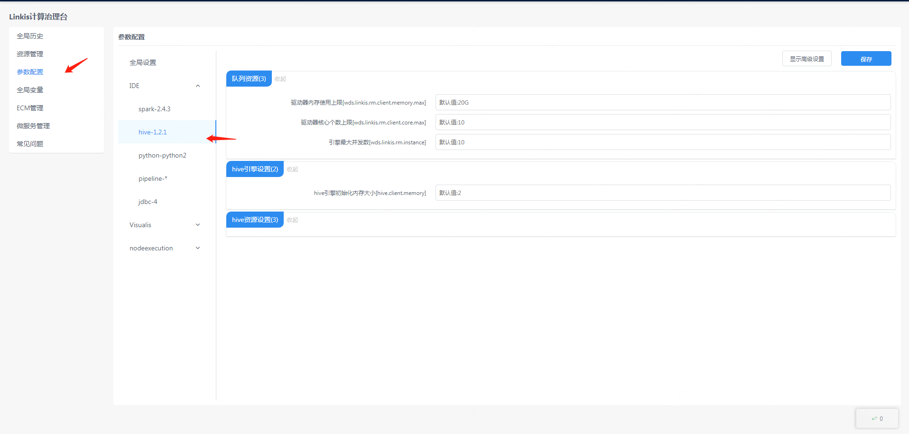

# Hive 引擎使用文档

本文主要介绍在Linkis1.0中，Hive引擎的配置、部署和使用。

## 1.Hive引擎使用前的环境配置

如果您希望在您的服务器上使用hive引擎，您需要保证以下的环境变量已经设置正确并且引擎的启动用户是有这些环境变量的。

强烈建议您在执行hive任务之前，检查下执行用户的这些环境变量。

| 环境变量名      | 环境变量内容   | 备注 |
|-----------------|----------------|------|
| JAVA_HOME       | JDK安装路径    | 必须 |
| HADOOP_HOME     | Hadoop安装路径 | 必须 |
| HADOOP_CONF_DIR | Hadoop配置路径 | 必须 |
| HIVE_CONF_DIR  | Hive配置路径   | 必须 |

表1-1 环境配置清单

## 2.Hive引擎的配置和部署

### 2.1 Hive版本的选择和编译

Hive的版本是支持hive1.x和hive2.x，默认是支持hive on MapReduce，如果您想改成Hive
on Tez，需要您按照此pr进行一下修改。

<https://github.com/WeBankFinTech/Linkis/pull/541>

默认支持的hive版本是1.2.1,如果您想修改hive的版本，比如想要修改成2.3.3，您可以找到linkis-engineplugin-hive模块，将\<hive.version\>标签进行改成2.3.3，然后单独编译此模块即可

### 2.2 hive engineConn部署和加载

如果您已经编译完了您的hive引擎的插件已经编译完成，那么您需要将新的插件放置到指定的位置中才能加载，具体可以参考下面这篇文章

https://github.com/WeBankFinTech/Linkis/wiki/EngineConnPlugin%E5%BC%95%E6%93%8E%E6%8F%92%E4%BB%B6%E5%AE%89%E8%A3%85%E6%96%87%E6%A1%A3

### 2.3 hive引擎的标签

Linkis1.0是通过标签来进行的，所以需要在我们数据库中插入数据，插入的方式如下文所示。

https://github.com/WeBankFinTech/Linkis/wiki/EngineConnPlugin%E5%BC%95%E6%93%8E%E6%8F%92%E4%BB%B6%E5%AE%89%E8%A3%85%E6%96%87%E6%A1%A3\#22-%E7%AE%A1%E7%90%86%E5%8F%B0configuration%E9%85%8D%E7%BD%AE%E4%BF%AE%E6%94%B9%E5%8F%AF%E9%80%89

## 3.hive引擎的使用

### 准备操作，队列设置

hive的MapReduce任务是需要用到yarn的资源，所以需要您在一开始就设置队列

图3-1 队列设置

### 3.1 Scriptis的使用方式

Scriptis的使用方式是最简单的，您可以直接进入Scriptis，右键目录然后新建hive脚本并编写hivesql代码。

hive引擎的实现方式通过实例化hive的Driver实例，然后由Driver来提交任务，并获取结果集并展示。

图3-2 hivesql的执行效果截图

### 3.2工作流的使用方式

DSS工作流也有hive的节点，您可以拖入工作流节点，然后双击进入然后进行编辑代码，然后以工作流的形式进行执行。

图3-5 工作流执行hive的节点

### 3.3 Linkis Client的使用方式

Linkis也提供了client的方式进行调用hive的任务，调用的方式是通过LinkisClient提供的SDK的方式。我们提供了java和scala两种方式进行调用，具体的使用方式可以参考<https://github.com/WeBankFinTech/Linkis/wiki/Linkis1.0%E7%94%A8%E6%88%B7%E4%BD%BF%E7%94%A8%E6%96%87%E6%A1%A3>。

## 4.Hive引擎的用户设置

除了以上引擎配置，用户还可以进行自定义的设置，包括hive Driver进程的内存大小等。

图4-1 hive的用户自定义配置管理台
