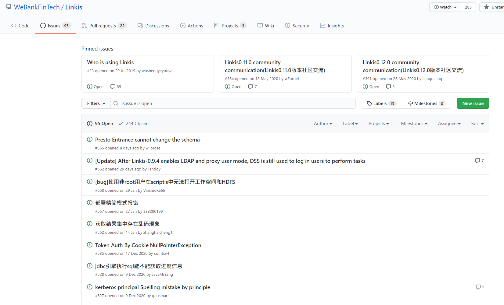

## 调优排障

在版本发布的准备过程中，我们会尽力提前发现部署和安装方面的问题然后修复，由于每个人部署的环境都有一些差异，我们有时候也没有办法提前预知所有的出现的问题和解决方案。不过由于社区的存在，大家的很多问题都会重合，也许大家遇到的安装部署方面的问题已经有用户发现并解决过，所以对于一些无法自行精确定位的问题，建议的排查级基本思路优先级可以按照：**社区issue专栏搜索关键词—\>在社区查阅《Q\&A问题总结》文档—\>定位系统日志—\>社区用户群咨询交流—\>定位源码远程debug**

### 一、如何进行异常日志定位

如果某个接口请求报错，我们可以根据接口的返回加过中定位出现问题的微服务，一般情况下可以**根据URL规范进行定位，**Linkis接口中的URL都遵循着一定的设计规范，即**/api/rest_j/v1/{applicationName}/.+的格式**，通过applicationName可以定位应用名，部分应用本身是一个微服务，这时候应用名和微服务名相同，部分应用归属于某个微服务，此时应该通过应用名查找归属的微服务，去对应的微服务下查看log日志，下面给出微服务和应用名的对应关系。

| **ApplicationName**  | **Microservice**     |
| -------------------- | -------------------- |
| cg-linkismanager     | cg-linkismanager     |
| cg-engineplugin      | cg-engineplugin      |
| cg-engineconnmanager | cg-engineconnmanager |
| cg-entrance          | cg-entrance          |
| ps-bml               | ps-bml               |
| ps-cs                | ps-cs                |
| ps-datasource        | ps-datasource        |
| configuration        |                      |
| instance-label       |                      |
| jobhistory           | ps-publicservice     |
| variable             |                      |
| udf                  |                      |

### 二、社区issue专栏搜索关键词

在github社区首页，issue专栏留存了社区用户遇到的部分问题和解决方案，非常适合在遇到问题后快速寻找解决方案，在filter过滤器中搜索报错的关键词即可。

### 三、《Q\&A问题总结》

在Linkis文档中，专门整理出一篇包含安装部署过程中常见问题汇总以及解决方案的文档《 [Linkis 1.0常见问题](https://github.com/WeBankFinTech/Linkis-Doc/blob/master/zh_CN/Tuning_and_Troubleshooting/Q&A.md) 》

### 四、定位系统日志

通常出现错误的情况可以分为三种阶段：安装执行install.sh时报错、启动微服务报错、启动引擎报错。

1. **执行install.sh时出现错误**，通常有如下几种情况

   1. 环境变量缺失：例如java/python/Hadoop/hive/spark的环境在标准版下需要进行配置，在安装脚本的时候也会进行相应的校验操作，如果遇到这种问题一般都会有很明确的缺少环境变量的提示，例如异常-bash
      spark-submit:command not found等。

   2. 系统版本不匹配：目前Linkis支持Linux大部分版本，对cent
      os版本的兼容性最好，某些系统版本会存在命令不兼容的情况，例如ubantu中对yum的兼容较差，可能会导致安装部署是出现yum相关的报错，此外也建议尽量不要在windows下部署linkis，目前没有脚本完全兼容.bat命令。

   3. 配置项缺失：linkis
      1.0版本需要修改的配置文件有两个，linkis-env.sh和db.sh，

      前者包含了linkis在执行期间需要加载的环境参数，后者是linkis自身需要存储相关表的数据库信息。通常情况下如果缺少对应的配置，报错信息会出现Key值相关的异常，例如db.sh没填写相关数据库配置时，会出现unknow
      mysql server host ‘-P’异常，这是由于host缺失导致的。

2. **启动微服务报错**

   Linkis将所有微服务的日志文件统一放入了logs目录，日志目录层级如下：

   ├── linkis-computation-governance  
   │ ├── linkis-cg-engineconnmanager  
   │ ├── linkis-cg-engineplugin  
   │ ├── linkis-cg-entrance  
   │ └── linkis-cg-linkismanager  
   ├── linkis-public-enhancements  
   │ ├── linkis-ps-bml  
   │ ├── linkis-ps-cs  
   │ ├── linkis-ps-datasource  
   │ └── linkis-ps-publicservice  
   └── linkis-spring-cloud-services  
   │ ├── linkis-mg-eureka  
   └─├── linkis-mg-gateway

   包含计算治理、公共增强、微服务管理三大微服务模块。每个微服务下包含linkis-gc.log、linkis.log、linkis.out三个日志。分别对应服务的GC日志、服务日志、服务的System.out日志。

   通常情况下，启动某个微服务出错时，可以cd到log目录的对应服务内查看相关日志排查问题，一般情况下出现频率最高的问题也可以分为三类：

   1.  **端口占用**：由于Linkis微服务的默认端口大多集中在9000，在启动前需要检查每个微服务的端口是否被其他微服务所占用，如果有占用的情况，需要更改conf/linkis-env.sh文件对应的微服务端口

   2.  **必要的配置参数缺失**：对于某些微服务来说，在启动是必须要加载某些用户自定义参数才能正常启动，例如linkis-cg-engineplugin微服务在启动时会加载conf/linkis.properties中的wds.linkis.engineconn.\*相关的配置，如果用户在安装后对Linkis的路径有更改，不对应修改该配置时，启动linkis-cg-engineplugin微服务就会报错。

   3.  **系统环境不兼容**：建议用户在部署安装时尽量参考官方文档中建议的系统及应用版本，以及安装必要的系统插件，例如expect、yum等，对于应用版本如果不兼容时，可能会引发该应用相关的错误，例如mysql5.7版本中由于SQL语句不兼容可能会导致安装过程中初始化db时，linkis.ddl和linkis.dml文件报错，需要参考《Q\&A问题汇总》或者部署文档进行相应的设置才能解决。

3. **微服务执行期报错**

   微服务执行期报错的情况比较复杂，遇到的情况也都因环境而异，但排查的方式基本一致，从对应的微服务报错目录出发，我们大致可以分为三种情况：

   1. **手动安装部署的微服务报错**：该类微服务日志统一放在log/目录下，定位到微服务之后，进入对应目录查看即可。

   2. **动态启动引擎失败**：资源不足，请求引擎失败：出现该类报错时，不一定是因为资源不足，由于前端只会抓取Spring项目启动后的日志，对于引擎启动前的错误无法很好的抓取。经过内测用户的实际使用过程中发现有三种高频问题：

      a.  **由于没有引擎目录权限无法创建引擎：**日志会打印到**cg-engineconnmanager微服务下的linkis.out**文件中，需要进入该文件查看具体原因。

      b.  **引擎lib包中存在依赖冲突**、**服务器内存资源不足无法正常启动：**由于已经创建了引擎目录，所以日志会打印到引擎下的stdout文件中，引擎路径可以参考c

      c.  **引擎执行期报错**：每个被启动的引擎都是在运行期动态加载启动的微服务，当引擎启动后，出现报错则需要去对应启动用户目录下寻找该引擎对应日志，对应的根路径为安装前**linkis-env**中填写的**ENGINECONN_ROOT_PATH**，如果安装后需要修改该路径，则需要在linkis.properties中修改wds.linkis.engineconn.root.dir。

### 五、社区用户群咨询交流

对于安装部署过程中按照上述流程定位仍无法解决的问题，可以在我们的社区群中将报错信息发出来，为了方便社区伙伴和开发人员帮助解决，提升效率，**建议您提问时，可以将问题现象、相关日志信息、已经排查过的地方一并发出，如果觉得可能是环境问题，则需要将对应的应用版本也一并列出**，我们提供了微信群和QQ群两种线上交流渠道，具体联系方式可以在Linkis的github首页最下方看到。

### 六、定位源码远程debug

通常情况下，对源码远程debug是定位问题最有效的方式，但相对查阅文档来说，需要用户对源码结构有一定的了解，这里建议您在远程debug前查阅Linkis WIKI中的《 [Linkis源码层级结构详解](https://github.com/WeBankFinTech/Linkis/wiki/Linkis%E6%BA%90%E7%A0%81%E5%B1%82%E7%BA%A7%E7%BB%93%E6%9E%84%E8%AF%A6%E8%A7%A3) 》,对项目的源码结构进行初步的了解，有一定程度上的熟悉之后，可以参考WIKI中的《 [如何DebugLinkis](https://github.com/WeBankFinTech/Linkis/wiki/Linkis%E5%92%8CDSS%E8%B0%83%E8%AF%95%E6%96%87%E6%A1%A3) 》一文调试对应微服务下的代码。

